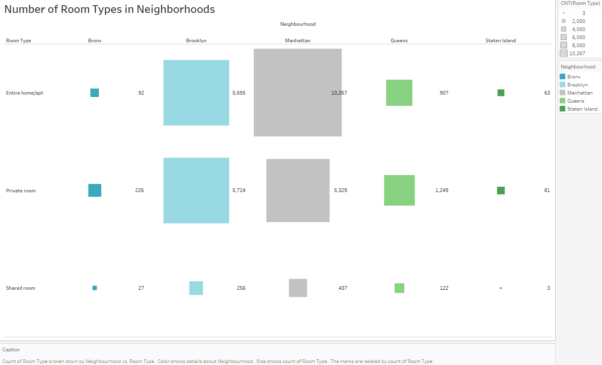
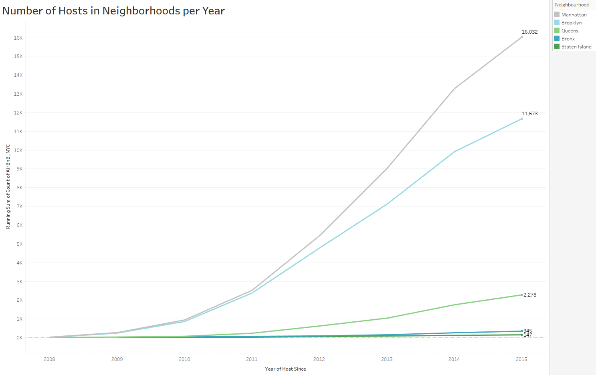
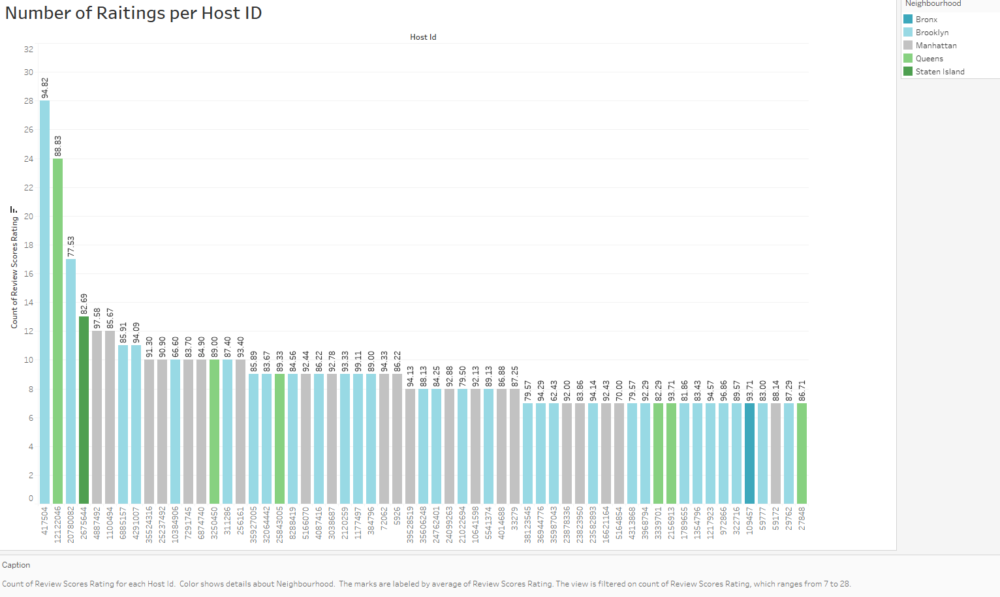
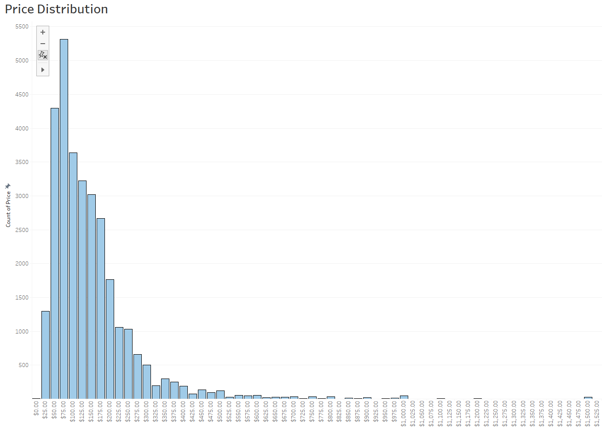
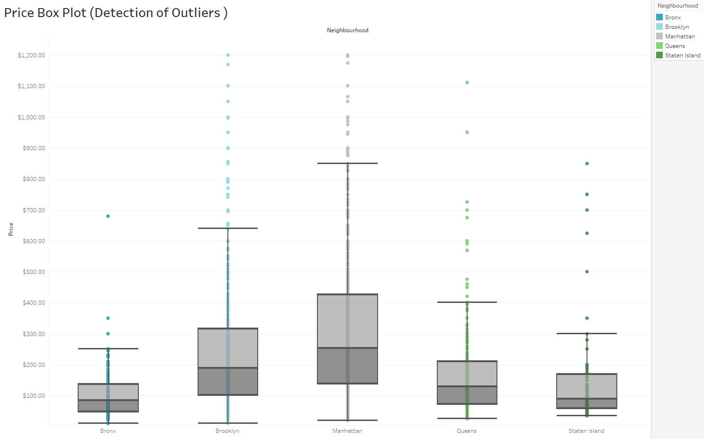
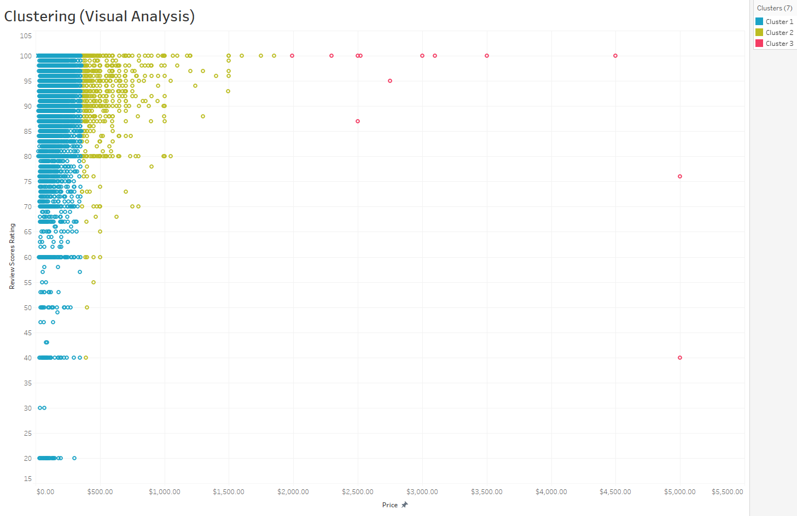
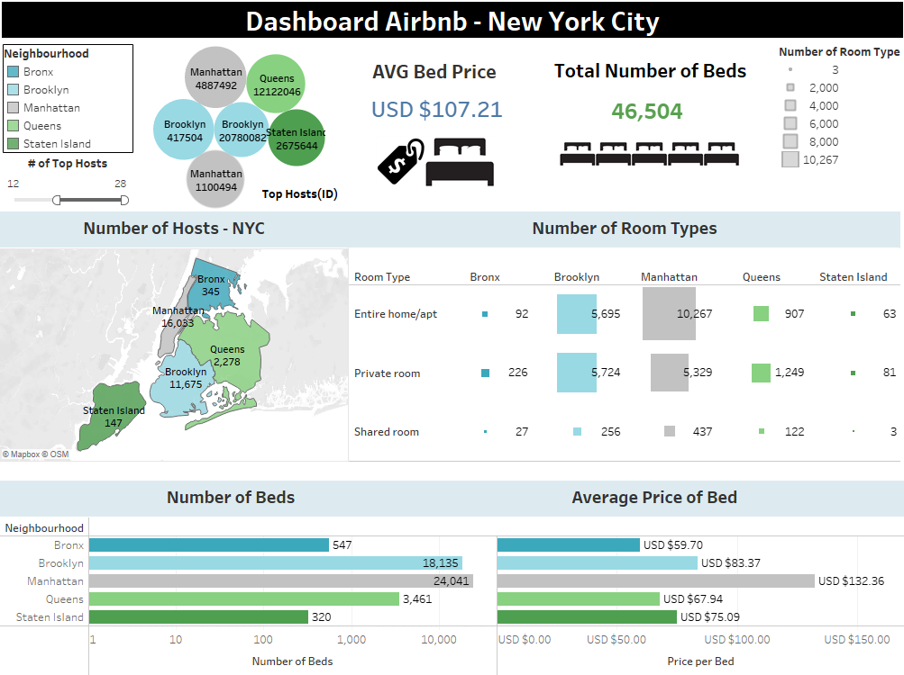

# Final-Project-Tableau

## Project/Goals

*Turning Airbnb data into easily understandable visual insights, using Tableau.

*Creating an impactful dashboard highlighting relevant indicators of the Airnbnb business model.

*Communicating insights with the correct visualization.

## Process

I decided to develop my project based on the option 2, dataset 3, Airbnb.

The project was develop in the 4 stages that are presented in the diagram below:

 

## Results

Within the development of this project, my questions were the following:

*Price:*

*What is the average price per room type and per bed across the neighborhoods in New York?

 

 

*Accommodation:*

*What is the availability in terms of number of beds and room types across the neighborhoods in New York?

 

 

*Hosts:*

*What is the number of Airbnb hosts in the different neighborhoods of New York that joined the company from 2008 to 2015? 

 

*What is the top Airbnb most reliable hosts? (For reliability it was considered the better the higher amount of reviews in conjunction with the higher average review score rating).

 

*Analytics:*

*What is the type of distribution of the price?

 

*How can outliers be identified?

 

*What clusters can be identified for price and hosts rating?

 

Finally, the following graph shows my dashboard that summarizes/highlights the main figures and features of all the previous graphs:

 

## Challenges 

*The data available restricted the possibility of defining better KPIs for the Airbnb business like: Occupancy rate, Average daily rate, Average length of stay, Revenue per available room, Net operation income, among others.

*Restrictions of the Tableau public version to save files and use some tools.

*Presence of nulls and data with the wrong format (Ex. Neighborhoods column).

## Future Goals

Having additional time:

*I would enrich the data source in order to be able to calculate the KPIs that are commonly used in the Airbnb business (Occupancy rate, Average daily rate, Average length of stay, Revenue per available room, Net operation income, among others).